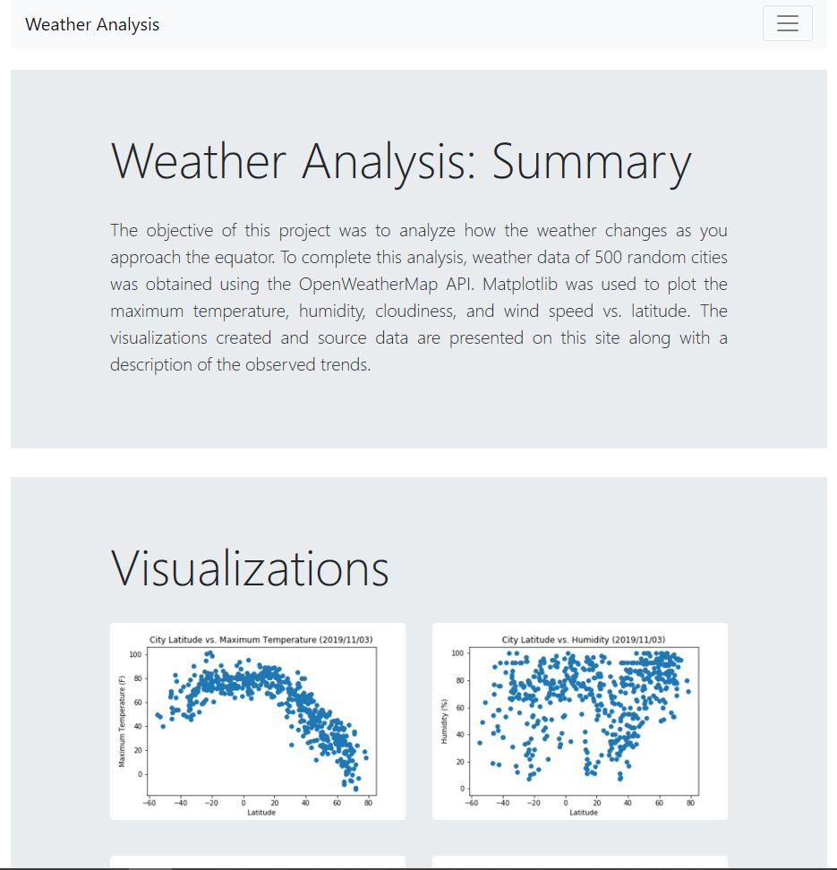
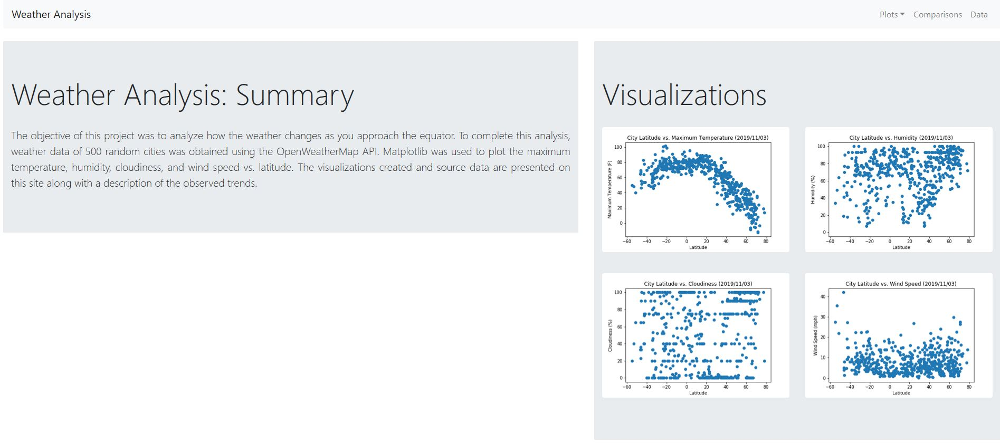

# WebVisualizations

## **Objective:**
The objective of this project is to create a website with Bootstrap to show how the weather changes as you approach the equator (maximum temperature, humidity, cloudiness, and wind speed vs. latitude). The visualizations created in the previous WeatherPy project and the source data used are presented along with a description of the observed trends. 

The website has a navigation menu at the top of each page and each page is responsive. The website contains 7 pages including: 
* Landing page with an explanation of the project
* 4 visualization pages (1 for each plot)
* Comparisons page showing all plots
* Data page with the source data 

## **Tools:**
1.	HTML - Bootstrap

## **Screenshot:**
Home (Small Screen)

Home (Large Screen)

Visualization - Maximum Temperature vs. Latitude

Comparisons

Data

